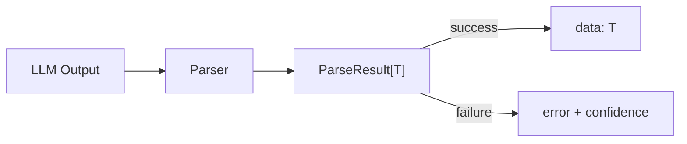

<div align="center">

# 🔧 Agent Output Parser

**Parse LLM text outputs into structured data — JSON, XML, Pydantic models, and more.**

[](https://pypi.org/project/agent-output-parser/)
[](https://pypi.org/project/agent-output-parser/)
[](LICENSE)

</div>

---

LLMs return text. You need data. This library bridges that gap.

```python
from agent_output_parser import JSONParser, PydanticParser
from pydantic import BaseModel

# JSON — auto-fixes LLM JSON issues
parser = JSONParser()
result = parser.parse(llm_output)
if result.success:
    data = result.data

# Pydantic — directly into typed models
class User(BaseModel):
    name: str
    age: int
    email: str | None = None

parser = PydanticParser(User)
result = parser.parse("Name: John\nAge: 30\nEmail: john@example.com")
# → User(name='John', age=30, email='john@example.com')
```

## 📦 Install

```bash
pip install agent-output-parser
```

> Python 3.9+, Pydantic 2.0+

## 🚀 Quick Start

```python
from agent_output_parser import JSONParser

# Parse JSON from mixed text
parser = JSONParser()
result = parser.parse('''
    Here is the data:
    ```json
    {"name": "Alice", "age": 28}
    ```
''')
assert result.success
print(result.data)  # {'name': 'Alice', 'age': 28}
```

## 📖 Parsers

### JSON Parser

Handles common LLM JSON issues automatically.

```python
from agent_output_parser import JSONParser

parser = JSONParser()

# Strips markdown code blocks
result = parser.parse('```json\n{"a": 1}\n```')

# Fixes trailing commas
result = parser.parse('{"a": 1, "b": 2,}')

# Extracts from mixed text
result = parser.parse('Answer: {"key": "value"} and some explanation')

# Handles single quotes
result = parser.parse("{'name': 'Alice'}")
```

### XML Parser

Extract data from XML-style tags.

```python
from agent_output_parser import XMLParser

parser = XMLParser(tag="result")
result = parser.parse('''
    Here is the result:
    <result>
        <name>John</name>
        <age>30</age>
    </result>
''')
print(result.data)  # {'name': 'John', 'age': '30'}
```

### Markdown Table Parser

Parse markdown tables into lists of dicts.

```python
from agent_output_parser import MarkdownParser

parser = MarkdownParser()
result = parser.parse('''
    | Name  | Age |
    |-------|-----|
    | John  | 30  |
    | Mary  | 25  |
''')
print(result.data)
# [{'Name': 'John', 'Age': '30'}, {'Name': 'Mary', 'Age': '25'}]
```

### Pydantic Parser

Parse directly into Pydantic models — no intermediate dict.

```python
from pydantic import BaseModel
from agent_output_parser import PydanticParser

class Movie(BaseModel):
    title: str
    year: int
    rating: float

parser = PydanticParser(Movie)

# From key-value text
result = parser.parse('''
    Title: The Matrix
    Year: 1999
    Rating: 8.7
''')
print(result.data)  # Movie(title='The Matrix', year=1999, rating=8.7)

# From JSON
result = parser.parse('{"title": "Inception", "year": 2010, "rating": 8.8}')
print(result.data)  # Movie(title='Inception', year=2010, rating=8.8)
```

### Regex Parser

Fine-grained extraction with custom patterns.

```python
from agent_output_parser import RegexParser

parser = RegexParser(patterns={
    "email": r"Email:\s*(\S+@\S+)",
    "phone": r"Phone:\s*(\d{3}-\d{4})",
})

result = parser.parse("Email: john@example.com, Phone: 123-4567")
print(result.data)  # {'email': 'john@example.com', 'phone': '123-4567'}
```

### Completeness Checker

Verify output has all required fields.

```python
from agent_output_parser import CompletenessChecker

checker = CompletenessChecker(
    required=["name", "email"],
    optional=["phone", "address"]
)

result = checker.check("Name: John\nEmail: john@example.com")
print(result.score)          # 0.5
print(result.is_complete)   # False
print(result.missing_required)  # ['email']
```

## 🏗️ Architecture



All parsers return `ParseResult[T]`:
- `success: bool` — did it parse?
- `data: T | None` — the parsed data
- `error: str | None` — why it failed
- `confidence: float` — how confident (0.0 to 1.0)

## 💡 Common Patterns

### Try Multiple Parsers

```python
from agent_output_parser import JSONParser, XMLParser, RegexParser

def parse_output(text: str):
    for parser in [JSONParser(), XMLParser(), RegexParser(...)]:
        result = parser.parse(text)
        if result.success:
            return result.data
    raise ValueError("Could not parse output")
```

### Retry with Different Parsers

```python
from agent_output_parser import JSONParser, PydanticParser

class User(BaseModel):
    name: str
    age: int

parser = PydanticParser(User)

# Try parsing, fall back to raw JSON
result = parser.parse(llm_output)
if result.success:
    return result.data
```

## 📄 License

[MIT](LICENSE)
